# (C# 코딩) 간단 계산기
## 개요
- C# 프로그래밍 학습
- 핵심기능: ...
- 화면구성: ...
## 실행 화면
- 1단계 코드의 실행 스크린샷
 
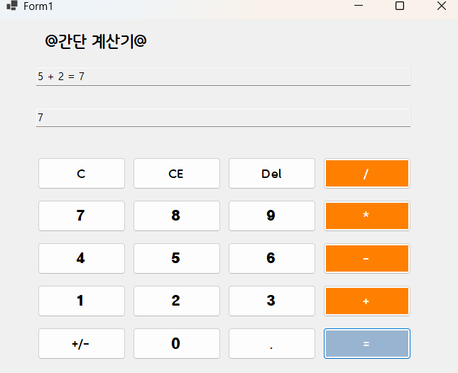

- 2단계 코드의 실행 스크린샷

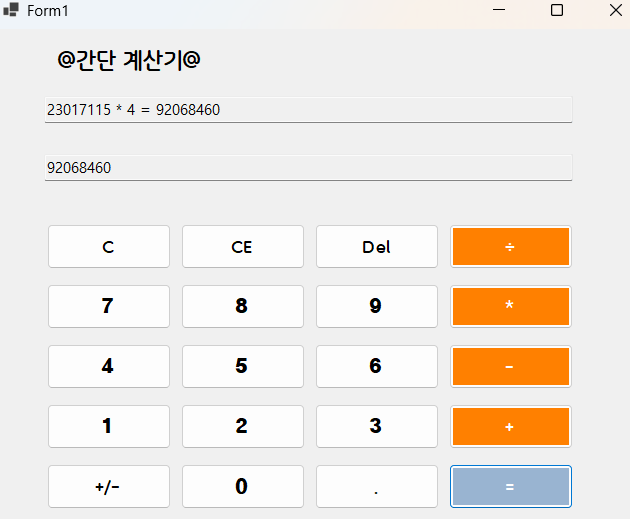
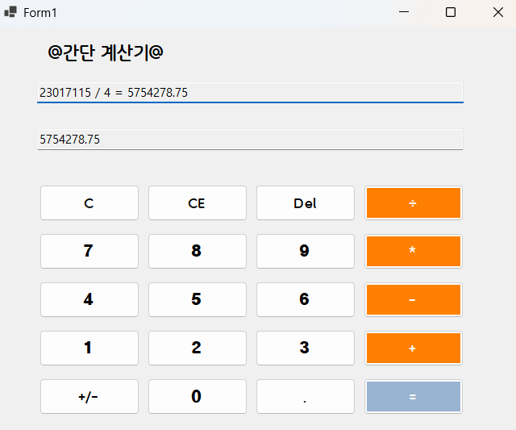
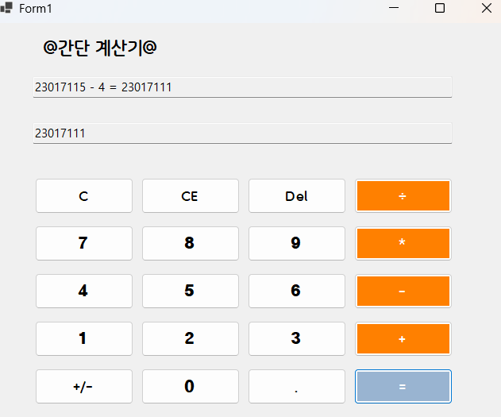

- 3단계 코드의 실행 스크린샷

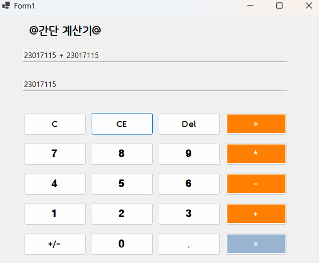
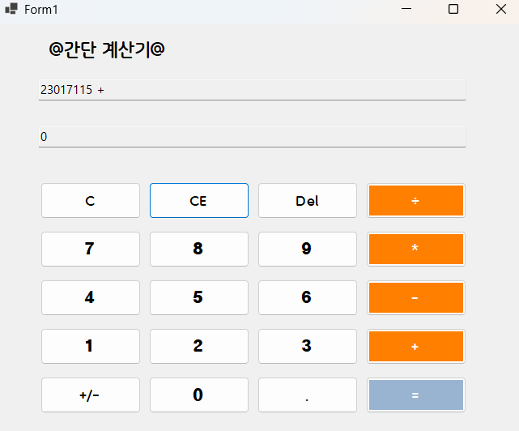
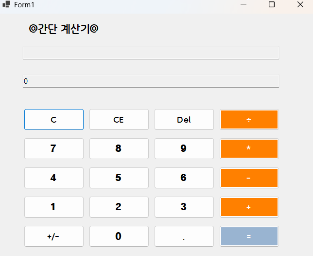
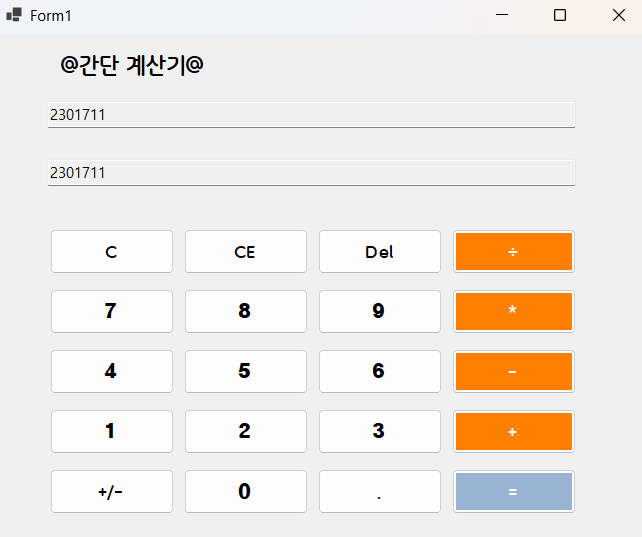

- 4단계 코드의 실행 스크린샷

## 배운 내용
- button 클릭 이벤트 처리 방법은 GTP의 도움을 받았습니다.

# (C# 코딩) 간단 계산기
## 개요
- C# 프로그래밍 학습
- 1줄 소개: 사용자 키보드 입력을 받아서 사칙연산 계산을 처리해주는 프로그램
- 사용한 플랫폼: copilot, ChatGPT, C#, .NET Windows Forms, Visual Studio, GitHub
- 사용한 컨트롤: TextBox 2개, Button 16개, TableLayoutPanel 1개
- 사용한 기술과 구현한 기능: Visual Studio를 이용하여 UI 디자인
- Substring 클래스를 이용한 사용자 입력 데이터 처리
- 수업 중에 배우고 사용했던 클래스들 관련된 설명
-
-
- 실습 중에 구현한 기능들 설명
- txtInput에 5 + 2를 입력하고 = 버튼을 누르면 txtInput에 5 + 2 = 7이 출력되고 txtOutput에는 정답인 7만 출력되게 과제1 완성
-
## 실행 화면 (과제1)
- 과제1 코드의 실행 스크린샷
- 

- 과제 내용
	- Label(이름 표시), TextBox(정수와 사칙연산 입력과 출력), Button(숫자와 사칙연산 입력), TableLayoutPanel(버튼 배치)
	- 구현 내용과 기능 설명
	- txtOutput 박스에 숫자를 입력하면 값이 표시되고, txtInput에는 현재 입력된 식이 함께 표시된다.
	- 연산자를 누르면 첫 번째 값과 연산자가 txtInput에 표시되고, 두 번째 숫자를 입력하면 식이 계속 업데이트된다.
	- = 버튼을 누르면 txtInput에는 전체 계산식(예: 5 + 2 = 7)이 출력되고, txtOutput에는 최종 결과(7)만 표시된다.
	- Del 버튼을 이용하여 입력된 숫자를 한 글자씩 삭제할 수 있으며, 이 과정에서 Substring 메서드를 활용하였다.

## 실행 화면 (과제2)
- 과제2 코드의 실행 스크린샷
 

- 과제 내용
	- 앞서 과제1 에서 진행한 사칙연산의 -, *, / 연산자들의 계산을 추가로 더하고 Del 버튼으로 입력된 숫자를 한 글자씩 삭제할 수 있게 구현하였다.
	- KeyDown 이벤트를 이용하여 키보드로도 숫자와 연산자를 입력할 수 있게 구현하였다. 

	## 실행 화면 (과제3)
- 과제3 코드의 실행 스크린샷
- 

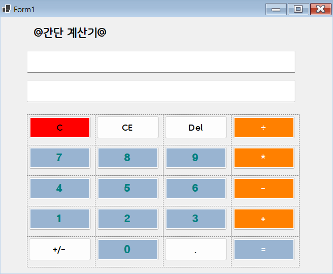

- 과제 내용
- del 키는 Backspace 키로 구현하였고, C 버튼은 ESC키로 CE 버튼을 추가하여 계산기 기능을 확장하였다.

1. 다음의 사례로 설명
- 23017115 + 100 = 23017215
2. C 버튼
- 현재의 모든 내용을 삭제하고 처음 (초기화된) 상태로 되돌아감
3. CE 버튼
- 마지막 입력한 피연산자(Operand) 값을 삭제함
- 100 입력 후에 CE 눌렀다면 100 값이 통째로 삭제됨
4. Del 버튼
- 마지막 입력된 글자 하나 (숫자 하나) 값을 삭제함
- 100 입력 후에 Del(Backspace) 눌렀다면 10 으로 변경됨

- CE 키가 자동으로 포커스가 잡혀서 코파일럿의 도움을 받아 코드를 수정함.
- 프로그램 시작하고 연산을 할 때 CE가 포커스가 안잡히게 됨.

- 계산기 디자인 수정

## 실행 화면 (과제4)
- 과제4 코드의 실행 스크린샷
- 
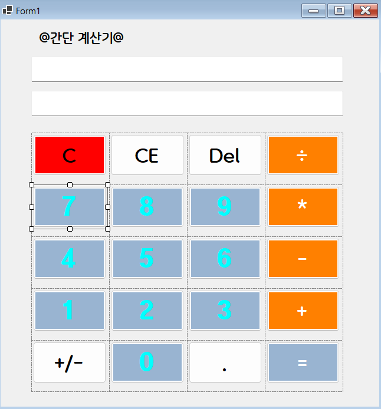
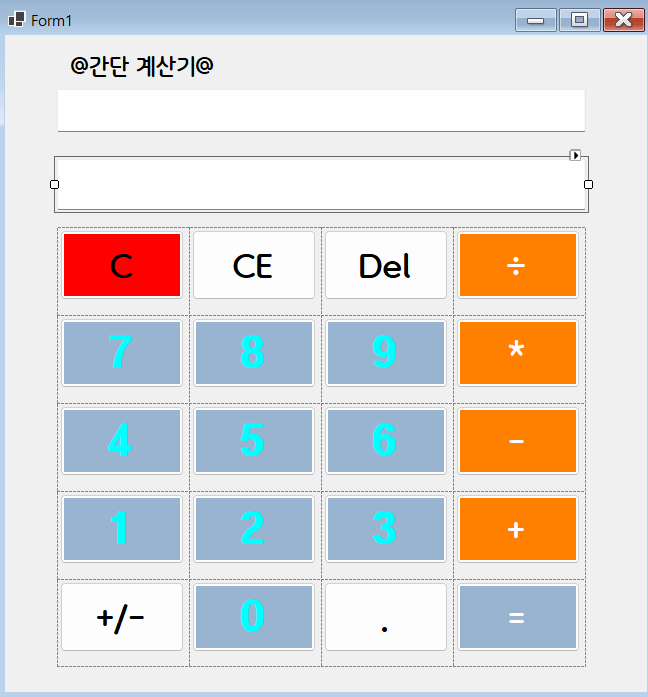
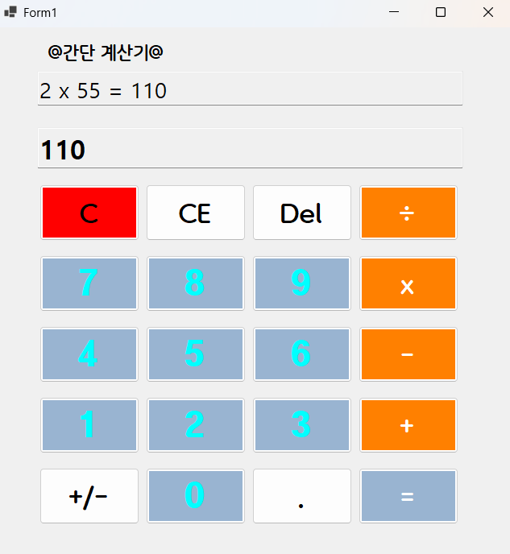

- 과제 내용
- 키 다운 이벤트는 이미 과제2 에서 진행 완료 하였으므로 모바일 디자인을 생각해 디자인 수정(폰트 크기 수정)
- 마지막 디자인 수정 과제4 *을 x로 교체 코딩과 테스트 완료
